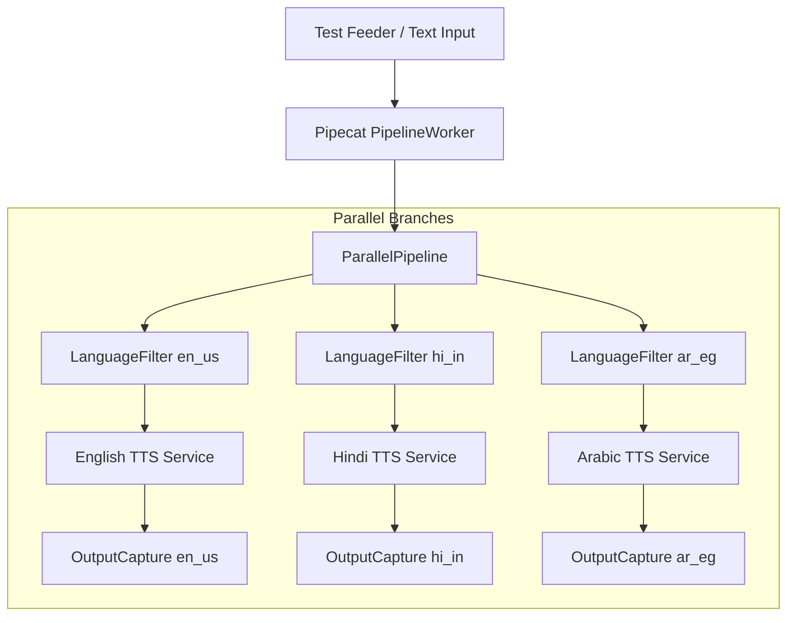

# Real-time Trilingual Customer Voice Support

This repository provides an orchestration and data-acquisition solution for building a real-time trilingual customer voice support system supporting three language subsets:
- **English (United States)** (`en_us`)
- **Hindi (India)** (`hi_in`)
- **Arabic (Egypt)** (`ar_eg`)

It utilizes the **Pipecat** orchestration framework to dynamically route inputs to distinct processing pipelines based on language.

---

## 1. Pipecat Orchestration Pipeline

We use the [Pipecat framework](https://github.com/pipecat-ai/pipecat) to define a parallel processing pipeline that dynamically detects input language and routes text frames to their respective language TTS pipelines.

### Pipeline Architecture



### Components

1. **Language Detection**: Custom Unicode block analyzer that identifies character ranges:
   - Devanagari script range (`U+0900` to `U+097F`) maps to **Hindi** (`hi_in`).
   - Arabic script range (`U+0600` to `U+06FF`) maps to **Arabic** (`ar_eg`).
   - Latin range maps to **English** (`en_us`).
2. **`LanguageFilter`**: A custom Pipecat `FrameProcessor` placed at the start of each language branch. It evaluates incoming `TextFrame`s and discards them if they don't match the target language, while letting control frames (like `StartFrame`/`EndFrame`) pass through to keep pipeline state synced.
3. **TTS Services Factory**: Reads `.env` configuration and instantiates the chosen provider for each language, falling back to a lightweight custom `MockTTSService` (which simulates voice synthesis and generates mock frames) when API credentials or models are not configured.
4. **`OutputCapture`**: A custom `FrameProcessor` placed at the end of each pipeline branch to intercept and verify the generated `TTSAudioRawFrame`s and speak events.

### Running the Orchestrator

Run the pipeline:
```bash
python3 trilingual_orchestrator.py
```
*(Or via the virtual environment binary directly: `.venv/bin/python trilingual_orchestrator.py`)*

### Adding Actual Models via `.env`

To replace the mock synthesizers with real models, uncomment the respective API keys and configure the provider variables in `.env`:

```env
# TTS Configuration for en_us (English - US)
# Supported providers: mock, elevenlabs, cartesia, openai
TTS_PROVIDER_EN_US=elevenlabs
TTS_MODEL_EN_US=eleven_turbo_v2_5
TTS_VOICE_EN_US=21m00Tcm4TlvDq8ikWAM

# Provider API Keys
ELEVENLABS_API_KEY=your_elevenlabs_api_key_here
```

---

## 2. Google FLEURS Dataset Downloader

To download sample voice data for validation, we have provided an optimized downloader script that downloads the first 5 audio samples and their transcriptions from the [Google FLEURS dataset](https://huggingface.co/datasets/google/fleurs) for all three subsets. 

Unlike standard loading methods which download multi-gigabyte archives, this script streams the archives directly over HTTP and terminates the connection immediately after extracting the first 5 samples. This keeps the network footprint extremely small (~10-12 MB total) and uses zero disk cache.

### Dataset Directory Structure

Running the downloader script creates a `fleurs_dataset` directory with the following structure:

```
fleurs_dataset/
├── en_us/
│   ├── sample_1.wav
│   ├── sample_1.txt
│   ├── ...
│   ├── sample_5.wav
│   ├── sample_5.txt
│   └── transcriptions.csv
├── hi_in/
│   └── ...
└── ar_eg/
    └── ...
```

### Running the Downloader

```bash
python3 download_fleurs.py
```

---

## Setup and Installation

1. **Create and Activate Virtual Environment**:
   ```bash
   python3 -m venv .venv
   source .venv/bin/activate
   ```
2. **Install Dependencies**:
   ```bash
   pip install -r requirements.txt
   ```